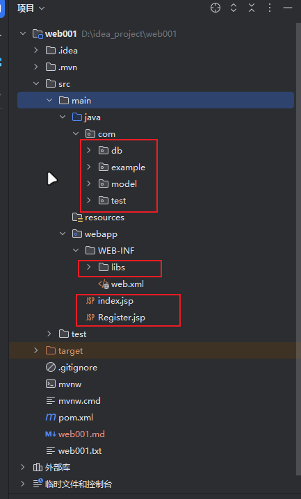

教程网址：https://www.bilibili.com/video/BV1Sm4y1d76Q?spm_id_from=333.788.videopod.episodes&vd_source=0e97b1103370ab6a31b09530b06f2f80&p=6


# 1. 设置登录页面 ”index.jsp"
```html
   <%@ page contentType="text/html; charset=UTF-8" pageEncoding="UTF-8" %>
<!DOCTYPE html>
<html>
    <head>
        <title>JSP - Hello World</title>
    </head>
    <body>
        <form method="post" action="http://localhost:8080/web001_war_exploded/Login">
            账号：<input type="text" name="id"><br>
            密码：<input type="password" name="password"><br>
            <input type="submit" value="登录"><input type="reset" value="重置">
        </form>
    </body>
</html>
```
# 新建后端java代码 LoginServlet.java
```java
   @WebServlet(name = "LoginServlet", urlPatterns = {"/Login"})
   public class LoginServlet extends HttpServlet {
   protected void doPost(HttpServletRequest request, HttpServletResponse response) throws ServletException, IOException {

   }
   protected void doGet(HttpServletRequest request, HttpServletResponse response) throws ServletException, IOException {

   }
   }
```
# 这时候运行会乱码
# 解决乱码问题，在LoginServlet.java中加入如下代码：
```
   //解决网页乱码问题
   response.setContentType("text/html;charset=utf-8");
   request.setCharacterEncoding("utf-8");
   response.setCharacterEncoding("utf-8");
```

# 数据库的东西搞完之后，然后新建一个model文件夹，下面写Userdata.java
其中写3个表中的东西
```java
package com.model;
public class Usedata {
private int id;
private String name;
private String password;
}
```


# 然后新建dp文件夹，这个里面用来操作数据库的方法
# 然后这个dp下面创建，Database
```java
   public class Database {
   public Database() {
   Class.forName("com.mysql.jdbc.Driver");
    }
   }
```
# 然后这里forName报错，在WEB-INF/lib下添加mysql-connector-java-5.1.47-bin.jar，然后添加到library中才行


# 然后新建类，看看是否可以连接数据库
```java
public class test {
public static void main(String[] args) throws SQLException, ClassNotFoundException {
Database db = new Database();
Database.showConnect();
}
}
```

# 这里补充一下项目结构，web下面新建Register.jsp注册页面



# 注册页面的java代码

```angular2html
<%@ page contentType="text/html;charset=UTF-8" language="java" %>
<html>
<head>
    <title>注册</title>
</head>
<body>
<form method="post" action="http://localhost:8080/web001_war_exploded/Login">
    用户名：<input type="text" name="id"><br>
    密码：<input type="password" name="password"><br>
    确认密码：<input type="password" name="password"><br>
    <input type="submit" value="注册"><input type="reset" value="重置">
</form>
</body>
</html>

```


# 然后准备在数据库类db/Database.java中写注册方法

```java
// 在login表里面添加数据
    public void insert(String name,String password) throws SQLException {
        PreparedStatement prep = conn.prepareStatement("insert into web001.login value (null,?,?)");
        prep.setString(1,name);
        prep.setString(2,password);
        prep.execute();
    }
```

# 知识：ArrayList：它是 Java 集合框架中的一个类，属于动态数组


# 把index.jsp代码给ai完善样式

```html
<%@ page contentType="text/html; charset=UTF-8" pageEncoding="UTF-8" %>
<!DOCTYPE html>
<html>
    <head>
        <title>JSP - Hello World</title>
    </head>
    <body>
    <a href="http://localhost:8080/web001_war_exploded/Register.jsp">注册</a>
        <form method="post" action="http://localhost:8080/web001_war_exploded/Login">
            账号：<input type="text" name="id"><br>
            密码：<input type="password" name="password"><br>
            <input type="submit" value="登录"><input type="reset" value="重置">
        </form>
    </body>
</html>
```

# 补充：检测账号密码(ai写的) idReg.test(userId)

```javascript
 // 校验账号：必填 + 3-15位 + 仅字母/数字
        const idReg = /^[A-Za-z0-9]{3,15}$/; // 正则表达式：匹配字母/数字，长度3-15
        if (userId === "") { // 空值校验
            showError("idError");
            isLegal = false;
        } else if (!idReg.test(userId)) { // 格式校验
            showError("idError");
            isLegal = false;
        } else {
            hideError("idError");
        }
```

# 在jsp页面中导入登录页面的name属性

```

```


